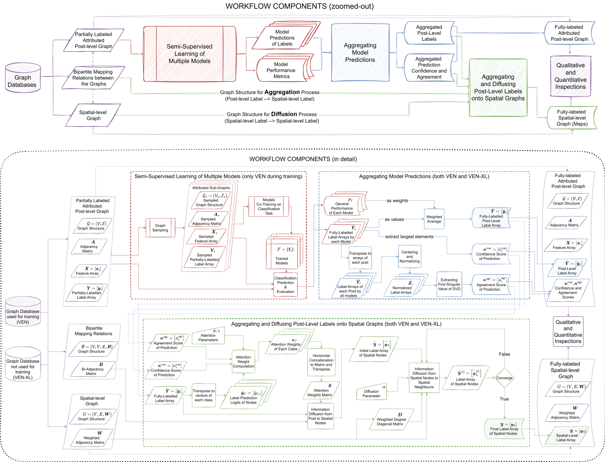
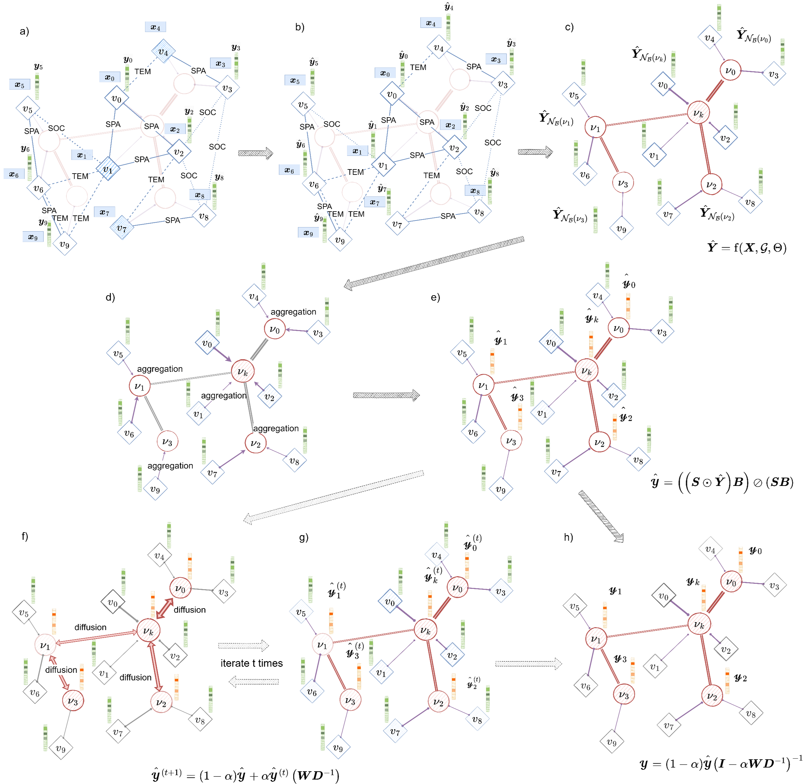

# Screening the stones of Venice: Mapping social perceptions of cultural significance through graph-based semi-supervised classification

This is the Code and Dataset for the Paper '*Screening the stones of Venice: Mapping social perceptions of cultural significance through graph-based semi-supervised classification*' published in *ISPRS Journal of Photogrammetry and Remote Sensing* showing the mapping of cultural significance in the city of Venice.

[](https://zenodo.org/badge/latestdoi/693302109)

## Cite as

Bai, N., Nourian, P., Luo, R., Cheng, T., & Pereira Roders, A. (2023). Screening the stones of Venice: Mapping social perceptions of cultural significance through graph-based semi-supervised classification. ISPRS Journal of Photogrammetry and Remote Sensing, 203, 135-164. https://doi.org/10.1016/j.isprsjprs.2023.07.018

```
@article{Bai2023StoneVenice, 
    title = {Screening the stones of Venice: Mapping social perceptions of cultural significance through graph-based semi-supervised classification}, 
    author = {Nan Bai and Pirouz Nourian and Renqian Luo and Tao Cheng and {Pereira Roders}, Ana},
    year = {2023},
    doi = {10.1016/j.isprsjprs.2023.07.018},
    volume = {203},
    pages = {135--164},
    journal = {ISPRS Journal of Photogrammetry and Remote Sensing},
    issn = {0924-2716},
    publisher = {Elsevier},
}

```

## Table of Content
#### [Requirement and Dependency](#requirement)
#### [Workflow and Dataset](#data)
#### [Model Training](#training)
#### [Aggregation and Diffusion](#diffusion)
#### [Results](#results)
#### [Analayses and Visualization](#analyses)
#### [Acknowledgements and License](#license)

## Requirement and Dependency<a name="requirement"></a>

esda==2.5.0

libpysal==4.7.0

matplotlib==3.5.1

networkx==2.6.3

numpy==1.22.2

pandas==1.4.0

pingouin==0.5.3

scipy==1.10.0

torch==2.0.1

torch_geometric==2.3.1

## Workflow and Dataset<a name="data"></a>
This project provides a workflow to learn the post-level and spatial-level labels of cultural significance in Venice from a multi-modal dataset [Heri-Graphs](https://github.com/zzbn12345/Heri_Graphs) originally collected from social media platform Flickr.
The workflow is illustrated as follows:



The main data being used is the [numpy version of Heri-Graphs Venice](https://github.com/zzbn12345/Heri_Graphs#dataset_np), which is fed into [PyTorch Geometric](https://pytorch-geometric.readthedocs.io/en/latest/) library as [customised datasets](https://pytorch-geometric.readthedocs.io/en/latest/tutorial/create_dataset.html). The exploration of dataset construction process can be found in [Dataset_PyG.ipynb](./Dataset_PyG.ipynb).

For both ```Venice``` (small version with 3k nodes) and ```Venice_XL``` (large version with 80k nodes) data, two versions are used, respectively the ```[data]_homo``` for graph-free and homogeneous-graph models (MLP, GCN, GAT, SAGE), and the ```[data]_links``` for heterogeneous-graph models (HeteroGNN and HGT). And for ```Venice_XL```, and additional ```[data]_knn``` was pre-processed for efficiency.

Additional label category systems from [Places365-CNNs](https://github.com/CSAILVision/places365) and geographical information from [Heri-Graphs](https://github.com/zzbn12345/Heri_Graphs) are used as data.

To download the full processed data (4GB), use [Google Drive](https://drive.google.com/file/d/1bJV7LUmBjOi079QghzNA0w8RW9ImcGo8/view?usp=sharing) and put everything in ```dataset/```.

For the meaning of data and labels, as well as the structure of the partially labelled dataset, check the original GitHub Page [https://github.com/zzbn12345/Heri_Graphs](https://github.com/zzbn12345/Heri_Graphs).

## Model Training<a name="training"></a>
### Baselines
Seven models are trained and tested for this paper:
| Baseline | Name in Paper | Name in Repo | Type | Note |
| ------------- | ------------- | ------------- | ------------- | ------------- |
| Random Dummy Classifier | RDC | Random | Graph-free | Generating random outputs based on the category distribution (prior) in the training set
| Multi-Layer Perceptron | MLP | MLP | Graph-free | Combining visual and textual features
| Graph Convolution Network | GCN | GCN | Homogeneous-graph | [GCNII (Chen et al., 2020)](https://pytorch-geometric.readthedocs.io/en/latest/generated/torch_geometric.nn.conv.GCN2Conv.html?highlight=gcnii)
| Graph Attention Network | GAT | GAT | Homogeneous-graph | [GAT (Velickovic et al., 2017)](https://pytorch-geometric.readthedocs.io/en/latest/generated/torch_geometric.nn.conv.GATConv.html#torch_geometric.nn.conv.GATConv)
| Graph Sample and Aggregate (GraphSAGE) | GSA | SAGE | Homogeneous-graph | [GraphSAGE (Hamilton et al., 2017)](https://pytorch-geometric.readthedocs.io/en/latest/generated/torch_geometric.nn.conv.SAGEConv.html?highlight=sage#torch_geometric.nn.conv.SAGEConv)
| Heterogeneous GNN with GraphSAGE | HGSA | HeteroGNN | Heterogeneous-graph | [HeteroGNN (Zhang et al., 2019)](https://pytorch-geometric.readthedocs.io/en/latest/generated/torch_geometric.nn.conv.HeteroConv.html?highlight=HeteroConv)
| Heterogeneous Graph Transformer | HGT | HGT | Heterogeneous-graph | [HGT (Hu et al., 2020)](https://pytorch-geometric.readthedocs.io/en/latest/generated/torch_geometric.nn.conv.HGTConv.html?highlight=HGT)

All models are trained with ```[model].py``` for hyper-parameter search, re-trained and saved as checkpoints with ```[model].ipynb``` for further inference.

### Checkpoints
The checkpoints used in the paper are saved as ```model_storage/[model]/[model]_best_model/model.pth```, except for GCN, which is saved as ```model_storage/[model]/[model]_knn_feature/model.pth```.

To download the model checkpoints, use [Google Drive](https://drive.google.com/file/d/1V9yptNxafnQGtqa1Ui_0ZVmUF3REzBUd/view?usp=sharing) and put everything in ```model_storage/```.

## Aggregation and Diffusion<a name="diffusion"></a>
The most significant contribution of this paper is aggregating the post-level predictions to nearby spatial nodes based on the predictions of different models, and then diffusing the soft labels on spatial graphs.

### Theoretical Approach
The concept of the approach is visualized in the following diagram, which can be further checked in detail with our [published paper](https://www.sciencedirect.com/science/article/pii/S0924271623001995):


### Implementation
The implementation of the aforementioned workflow is conducted respectively in [Merging of Predicted Labels.ipynb](./Merging%20of%20Predicted%20Labels-VEN_XL.ipynb) and [Merging of Predicted Labels-VEN_XL.ipynb](./Merging%20of%20Predicted%20Labels-VEN_XL.ipynb).

## Results<a name="results"></a>

### Model Training Results
The numerical results of model performance for all models are organized as various csv files, respectively saved in ```results/[model]/```, including confusion matrices, per-class metrics, post-level predictions, general metrics on test and validation sets, as well as the training curves.

Alternative performance using kNN network are saved in ```results/[model]/kNN/```, if available.

Ablation studies of masking visual and textual features during inference, as well as using Social, Spatial, and Temporal links individually during inference, are given in ```results/[model]/Ablation```.

The direct inferences of trained model checkpoints on the ```Venice_XL``` data are available under ```results/[model]/Venice-XL/```.

For ```GAT``` and ```SAGE```, results of conducting [GNNExplainer](https://pytorch-geometric.readthedocs.io/en/latest/generated/torch_geometric.explain.algorithm.GNNExplainer.html) are saved under ```results/[model]/Explanation```.

### Aggregated Results
Following the workflow proposed in [earlier section](#diffusion), the trained model checkpoints are first aggregated as an ensemble. The result of the ensemble for ```VEN``` and ```VEN_XL``` are respectively saved in ```results/General_Results_[data]/```, including confusion matrices, per-class metrics, and post-level predictions.

After the spatial aggregation and diffusion, the spatial-level predictions are saved in the same folders ```results/General_Results_[data]/```, together with the results from spatial statistics, such as global and local Moran's I under different parameters.

## Analyses and Visualization<a name="analyses"></a>
[```Training Curves.ipynb```](./Training%20Curves.ipynb) visualizes the training curves on training set and validation set.

[```Alternative Performance.ipynb```](./Alternative%20Performance.ipynb) visualizes the results of ablation studies.

[```Association.ipynb```](./Association.ipynb) draws the confusion matrices and co-occurence matrices of OUV categories and HA categories.

[```Lexicon of Predictions.ipynb```](./Lexicon%20of%20Predictions.ipynb) analyzes the results of explanations generated with GNNExplainer and saves the keyword lexicon as a network in [```results/Gephi map/```](./results/Gephi%20map/) as Node and Link tables. And the network is visualized in Gephi with ```Explainable_Lexicon.gephi```.

The final generated maps are saved as a QGIS project in [```results/QGIS map```](./results/QGIS%20map/) as ```Venezia.qgz```. Note the associated data tables might need to be set up manually. These maps eventually will look like the following figure from the article:


## Acknowledgements and License<a name="license"></a>
This project applied the pretrained models of the following projects which are openly released on GitHub or published as python packages. Part of the codes are adpated from the original codes.

[Heri-Graphs](https://github.com/zzbn12345/Heri_Graphs)

[Places365-CNNs](https://github.com/CSAILVision/places365)

[PyTorch-Geometric](https://pytorch-geometric.readthedocs.io/en/latest/index.html)

[WHOSe_Heritage](https://github.com/zzbn12345/WHOSe_Heritage)

The workflows and datasets of this paper can be used under the Creative Common License (Attribution [CC BY 4.0](https://creativecommons.org/licenses/by/4.0/)). 
Please give appropriate credit, such as providing a link to [our paper](https://www.sciencedirect.com/science/article/pii/S0924271623001995) or to [this github repository](https://github.com/zzbn12345/Stones_Venice).
The copyright of all the downloaded and processed images belongs to the image owners.
